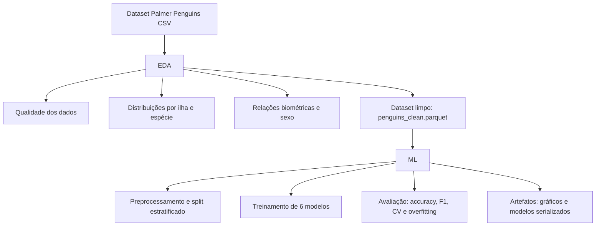

# Análise Exploratória e Classificação de Espécies de Pinguins

Repositório técnico para EDA e classificação supervisionada no dataset Palmer Penguins.

## Objetivo

1. Caracterizar qualidade e distribuição dos dados (EDA).
2. Avaliar capacidade de separação de espécies por medidas biométricas.
3. Treinar e comparar modelos de classificação multiclasse.

## Estrutura Essencial

```text
eda-penguins-case/
├── main.py
├── src/
├── notebooks/
│   ├── 01_eda_notebook.ipynb
│   └── 02_ml_notebook.ipynb
├── dataset/
├── outputs/graficos/
├── models/
└── docs/
    ├── 01_relatorio_eda.md
    └── 02_resultados_ml.md
```

## Execução

```bash
python -m venv .venv
source .venv/bin/activate
pip install -r requirements.txt
python main.py
```

Execução em notebook:

1. [notebooks/01_eda_notebook.ipynb](notebooks/01_eda_notebook.ipynb)
2. [notebooks/02_ml_notebook.ipynb](notebooks/02_ml_notebook.ipynb)

## Fluxo Resumo (EDA e ML)



## Resultados Principais

1. Qualidade de dados: baixa taxa de ausências, concentrada em sex.
2. Distribuição geográfica: maior concentração na ilha Biscoe.
3. Distribuição por espécie: Adelie predominante.
4. Relação espécie-medidas: separação clara por massa, nadadeira e bico.
5. Classificação: acurácia de teste entre 97.01% e 100.00% nos modelos avaliados.

## Créditos e Licença dos Dados

Breve apresentação:

O Palmer Penguins é um dataset aberto de biometria de pinguins antárticos, amplamente usado em ensino e benchmarking de análise de dados e classificação multiclasse.

Créditos e conformidade de licença:

1. Coleta: Dr. Kristen Gorman.
2. Instituição: Palmer Station Antarctica LTER.
3. Referência: Gorman KB, Williams TD, Fraser WR (2014), PLoS ONE 9(3): e90081.
4. Licença: CC0 (domínio público), permitindo uso, modificação e redistribuição.
5. Apesar de CC0 não exigir atribuição legal, este projeto mantém atribuição explícita por boa prática acadêmica e técnica.

## Documentação Técnica

1. [docs/01_relatorio_eda.md](docs/01_relatorio_eda.md)
2. [docs/02_resultados_ml.md](docs/02_resultados_ml.md)

