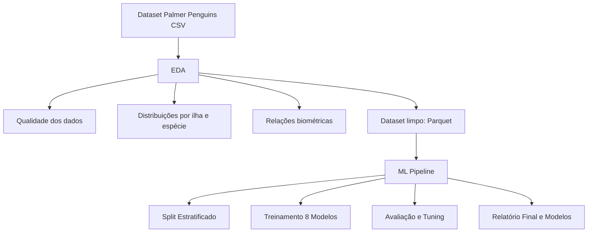

# EDA & Penguins Classification

<p align="center">
  
</p>

<p align="left">
	
	
	
	
</p>

Repositório técnico focado em Análise Exploratória de Dados (EDA) e classificação supervisionada multiclasse utilizando o dataset Palmer Penguins. O projeto demonstra um fluxo completo desde a limpeza de dados até a comparação de 8 modelos de Machine Learning.

## [>] SYS.NAVEGAÇÃO

[Objetivo](#-objetivo) • [Estrutura](#-estrutura-essencial) • [Execução](#-execução) • [Fluxo](#-fluxo-resumo-eda-e-ml) • [Resultados](#-resultados-principais)

---

## [~] OBJETIVO_SISTEMA

1. **Caracterização**: Avaliar qualidade e distribuição dos dados biométricos.
2. **Discriminação**: Analisar a separabilidade das espécies via medidas físicas.
3. **Modelagem**: Treinar e comparar 8 algoritmos de classificação (Ensembles, SVM, MLP).

## [=] ESTRUTURA_ESSENCIAL

```
eda-penguins-case/
├── assets/               # HUDs e Banner Cyberpunk
├── dataset/              # Dados originais e processados (Parquet)
├── docs/                 # Relatórios automáticos de EDA e ML
├── models/               # Modelos serializados (.pkl)
├── notebooks/            # Exploração interativa (Jupyter)
├── outputs/              # Gráficos e visualizações geradas
├── src/                  # Módulos de processamento e treinamento
├── main.py               # Orquestrador do pipeline completo
├── requirements.txt      # Dependências do sistema
└── README.md             # Documentação técnica
```

---

## [*] INSTALAÇÃO_E_EXECUÇÃO

### 1. Preparar Ambiente
```bash
python -m venv .venv
source .venv/bin/activate  # Linux/macOS
pip install -r requirements.txt
```

### 2. Executar Pipeline
```bash
python main.py
```

---

## [&] FLUXO_RESUMO_EDA_E_ML



---

## [#] RESULTADOS_PRINCIPAIS

- **Qualidade**: Baixa taxa de ausências, tratadas via limpeza seletiva.
- **Biometria**: Separação clara entre espécies (Gentoo vs Adelie vs Chinstrap) através de massa corporal e comprimento de nadadeira.
- **Classificação**: Modelos atingiram acurácia de teste entre **98.51% e 100%**, com alta robustez em validação cruzada.

---


