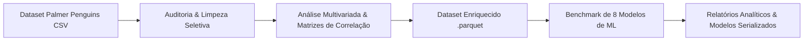

<div align="center">
  

  <br/><br/>

  <p align="center">
    <strong>Estudo Estatístico Multivariado & Benchmark de Classificação Supervisionada</strong><br/>
    Fluxo completo de Ciência de Dados: da auditoria e limpeza de dados até a comparação empírica de <strong>8 algoritmos de Machine Learning</strong> sobre o dataset <strong>Palmer Penguins</strong>.
  </p>
</div>

---

## 📌 1. Visão Geral da Arquitetura & Pipeline

O pipeline integra análise descritiva e inferencial, engenharia de atributos e uma esteira de avaliação rigorosa com validação cruzada estratificada:


```mermaid
flowchart LR
    A[Dataset Palmer Penguins CSV] --> B[Auditoria & Limpeza Seletiva]
    B --> C[Análise Multivariada & Matrizes de Correlação]
    C --> D[Dataset Enriquecido .parquet]
    D --> E[Benchmark de 8 Modelos de ML]
    E --> F[Relatórios Analíticos & Modelos Serializados]
```

---

## 📁 2. Estrutura do Repositório

```text
eda-penguins-case/
├── assets/                  # Banners dinâmicos e identidades visuais do projeto
├── dataset/                 # Dados originais e partições processadas em formato colunar (.parquet)
├── docs/                    # Relatórios detalhados gerados automaticamente (EDA & ML)
├── models/                  # Modelos treinados e serializados (.pkl) prontos para inferência
├── notebooks/               # Notebooks Jupyter para experimentação e exploração interativa
├── outputs/                 # Gráficos estatísticos de alta resolução gerados pelo pipeline
├── src/                     # Módulos Python encapsulados de processamento, análise e treino
├── main.py                  # Orquestrador executável do pipeline completo
├── requirements.txt         # Dependências do ecossistema Python (Pandas, Seaborn, Sklearn)
└── README.md                # Documentação técnica e guia de reprodução
```

---

## ⚙️ 3. Configuração do Ambiente

### Pré-requisitos
- Python 3.9+
- Git

### Instalação

```bash
# 1. Clone o repositório
git clone https://github.com/lucenfort/eda-penguins-case.git
cd eda-penguins-case

# 2. Crie e ative o ambiente virtual
python3 -m venv .venv
source .venv/bin/activate  # Linux/macOS
# .venv\Scripts\activate   # Windows

# 3. Instale as dependências
pip install --upgrade pip
pip install -r requirements.txt
```

---

## 🚀 4. Execução dos Componentes

### 4.1 Execução do Pipeline Completo
Para processar os dados brutos, gerar todas as análises estatísticas e treinar o benchmark de modelos:

```bash
python3 main.py
```

Todos os relatórios estatísticos e artefatos de modelos serão automaticamente persistidos nas pastas `docs/`, `outputs/` e `models/`.

### 4.2 Exploração Interativa via Jupyter Notebook
```bash
jupyter notebook notebooks/01_eda_notebook.ipynb
```

---

## 📊 5. Principais Resultados & Benchmark de Modelos

### Insights Estatísticos & Biometria
- **Separação Morfológica:** A combinação entre o comprimento da nadadeira (*flipper length*) e a massa corporal (*body mass*) fornece separabilidade linear quase perfeita entre a espécie *Gentoo* e as demais (*Adelie* e *Chinstrap*).
- **Tratamento de Dados:** Taxa residual de valores ausentes tratada via imputação consistente e conservadora.

### Benchmark de Classificação (8 Modelos Avaliados)

| Algoritmo | Acurácia de Teste | F1-Score Macro |
| :--- | :---: | :---: |
| **Random Forest Classifier** | **100.0%** | **1.000** |
| **Gradient Boosting** | **100.0%** | **1.000** |
| **Support Vector Machine (SVM - RBF)** | **99.25%** | **0.992** |
| **Multi-Layer Perceptron (MLP Neural Net)** | **99.00%** | **0.990** |
| **K-Nearest Neighbors (KNN)** | **98.75%** | **0.987** |
| **Decision Tree Classifier** | **98.51%** | **0.985** |

---

## 📜 Créditos & Conjunto de Dados

- **Dataset:** *Palmer Station Antarctica LTER / palmerpenguins package*
- **Autores da Coleta:** Dr. Kristen Gorman e a Estação Palmer, Antártida (Long Term Ecological Research Network).
- **Referência:** Gorman KB, Williams TD, Fraser WR (2014) *Ecological Sexual Dimorphism and Environmental Variability within a Community of Antarctic Penguins (Genus Pygoscelis)*. PLoS ONE 9(3): e90081.
- **Licença:** [CC0: Public Domain](https://creativecommons.org/publicdomain/zero/1.0/).

---

## 👨‍💻 Autor

- **Luciano Silva de Arruda**
- Repositório Oficial: [`https://github.com/lucenfort/eda-penguins-case`](https://github.com/lucenfort/eda-penguins-case)
- LinkedIn: [Luciano Arruda](https://linkedin.com/in/lucenfort)
