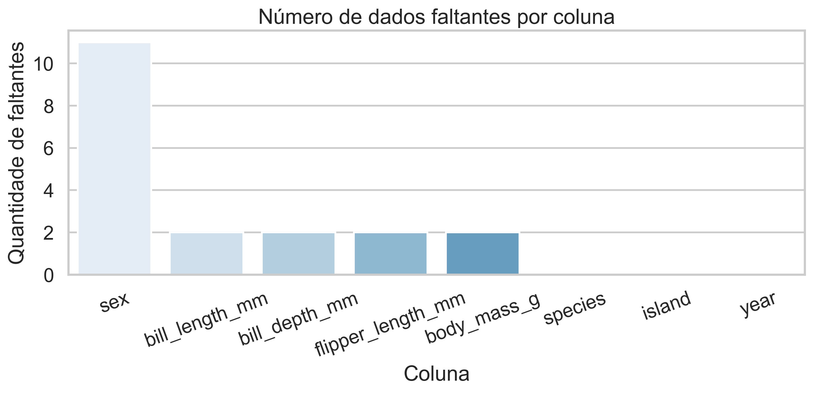
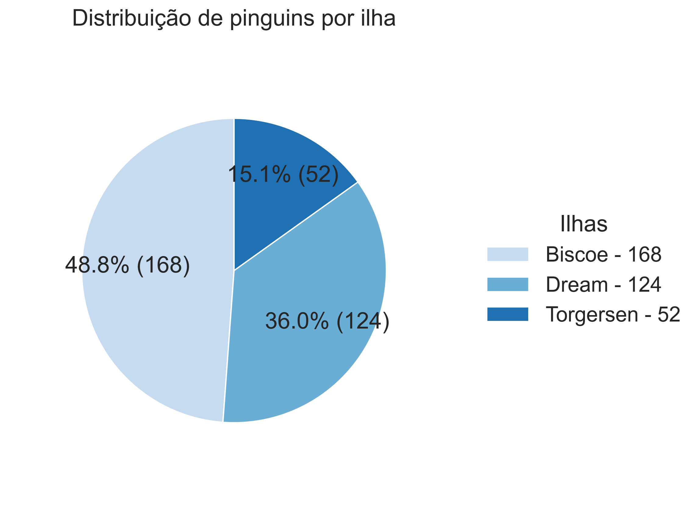
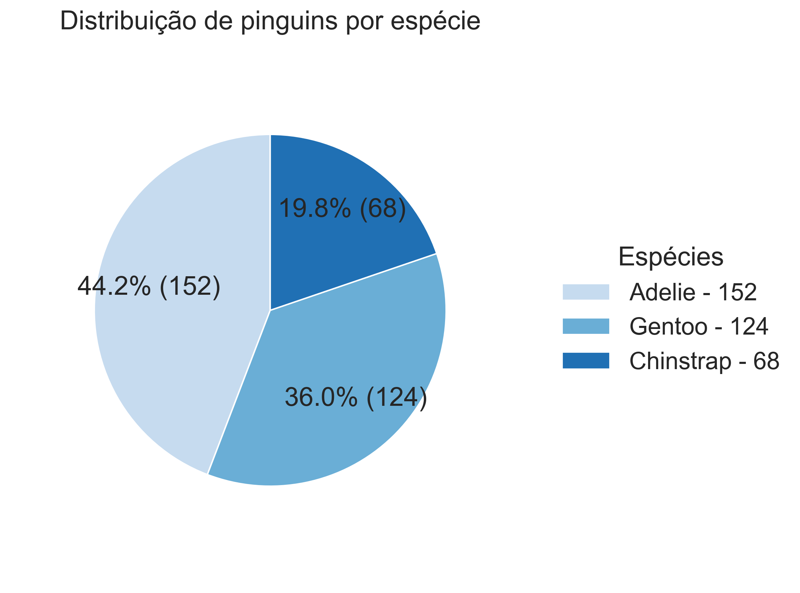
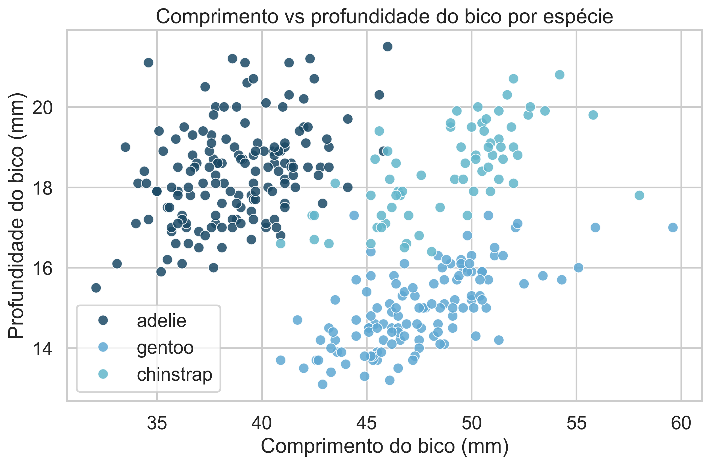
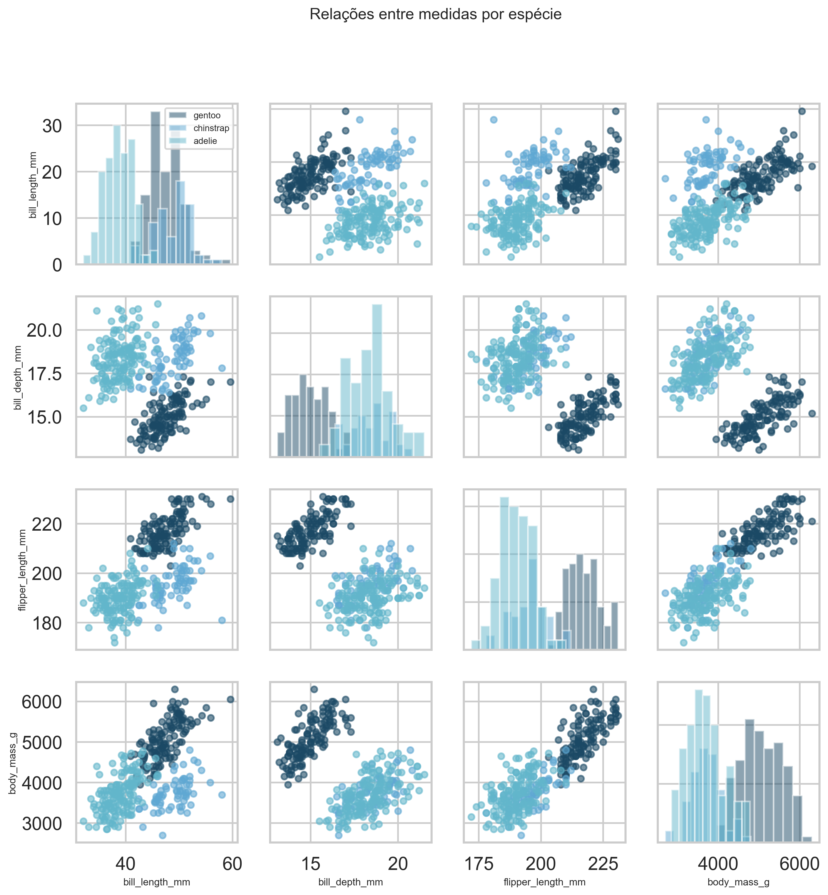
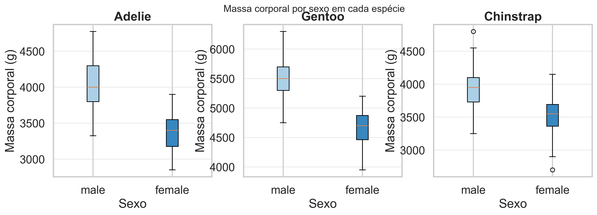
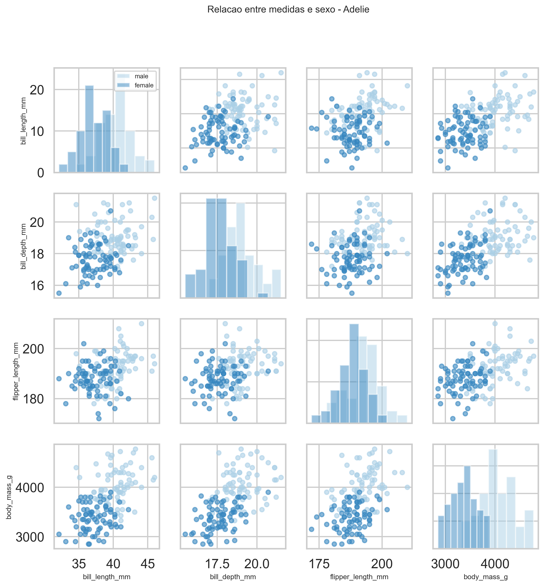
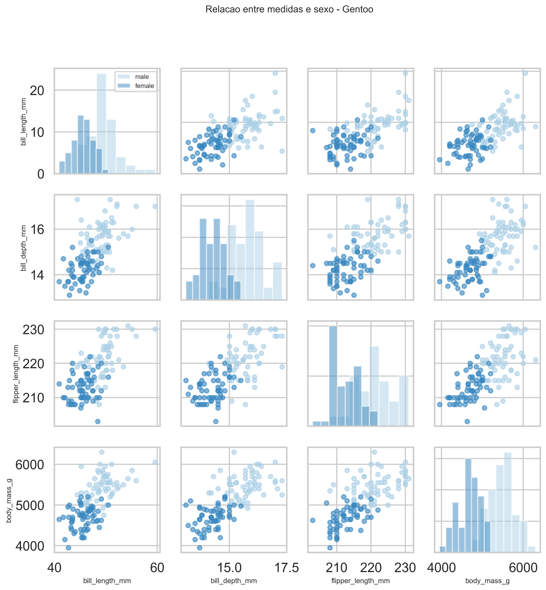
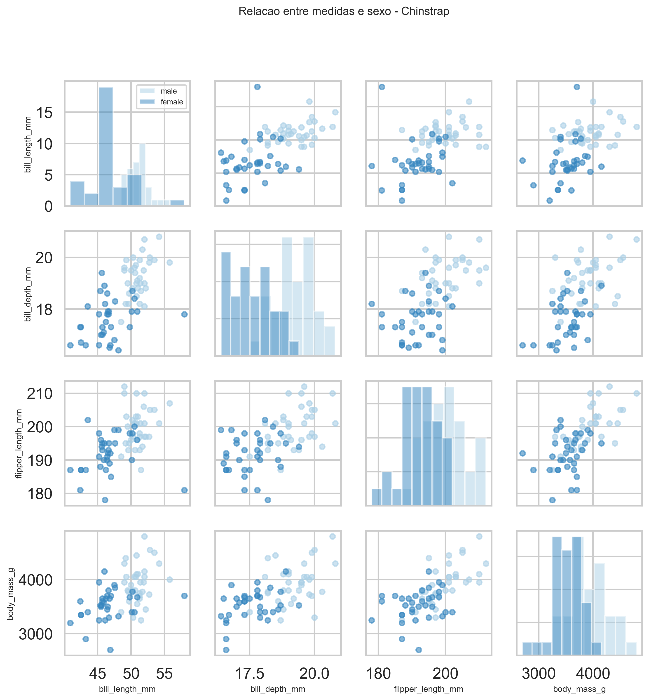

# Relatório Técnico de EDA

## Escopo

Análise exploratória do dataset Palmer Penguins com foco em qualidade dos dados, distribuição da população e relação entre variáveis biométricas, seguindo o pipeline da fase 1 do projeto.

## Base de Dados

1. Fonte: Palmer Penguins (344 registros).
2. Variáveis principais: species, island, sex, bill_length_mm, bill_depth_mm, flipper_length_mm, body_mass_g.
3. Conversões aplicadas: normalização de categorias para lowercase e cast de medidas para Float64.

## Etapa 1: Qualidade dos Dados

Pergunta: quais registros estão incompletos?

Resultado:

1. Ausência concentrada em sex.
2. Medidas biométricas com poucas lacunas.
3. species e island sem lacunas.

Interpretação:

1. O dataset é adequado para análise estatística e modelagem supervisionada.
2. A ausência em sex não compromete a classificação por species, mas limita análises mais finas de dimorfismo sem filtros.

Figura:

## Etapa 2: Distribuição Geográfica

Pergunta: de quais ilhas vem a maior parte dos pinguins?

Resultado:

1. Biscoe é a ilha com maior volume.
2. Dream aparece em segundo nível de representação.
3. Torgersen apresenta menor participação relativa.

Interpretação:

1. O conjunto não é geograficamente uniforme.
2. Avaliações de desempenho por subgrupo geográfico são recomendadas em expansões futuras.

Figura:

## Etapa 3: Composição por Espécie

Pergunta: quais espécies são mais frequentes?

Resultado:

1. Adelie é a espécie majoritária.
2. Gentoo aparece em volume intermediário alto.
3. Chinstrap é a menor classe entre as três.

Interpretação:

1. Existe leve desbalanceamento entre classes.
2. O desbalanceamento é moderado e não impediu bons resultados de classificação.

Figura:

## Etapa 4: Relação entre Medidas e Espécie

Pergunta: medidas corporais diferenciam espécies?

Resultado:

1. bill_length_mm e bill_depth_mm separam bem grupos no plano bidimensional.
2. flipper_length_mm e body_mass_g reforçam a separabilidade, especialmente para Gentoo.
3. Pairplot confirma estrutura multivariada consistente entre espécies.

Interpretação:

1. As variáveis biométricas possuem sinal discriminativo forte.
2. O comportamento observado na EDA antecipa alta performance dos classificadores supervisionados.

Figuras:

## Etapa 5: Relação entre Medidas e Sexo

Pergunta: existe dimorfismo sexual observável dentro de cada espécie?

Resultado:

1. Boxplots mostram diferença de massa entre sexos nas três espécies.
2. Pairplots por espécie indicam sobreposição parcial, com separação mais evidente em algumas medidas.

Interpretação:

1. Existe sinal de dimorfismo sexual.
2. Esse sinal não substitui classificação formal de sexo quando é exigida alta confiabilidade individual.

Figuras:

