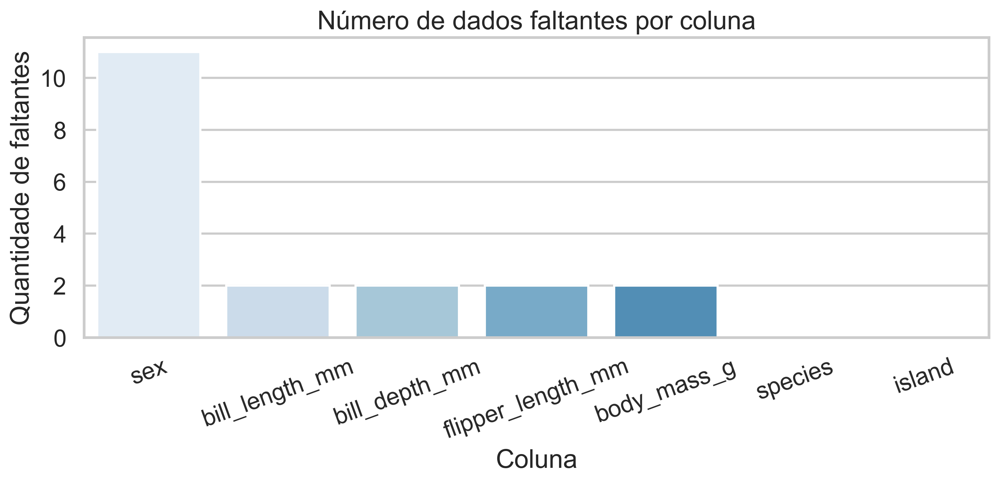
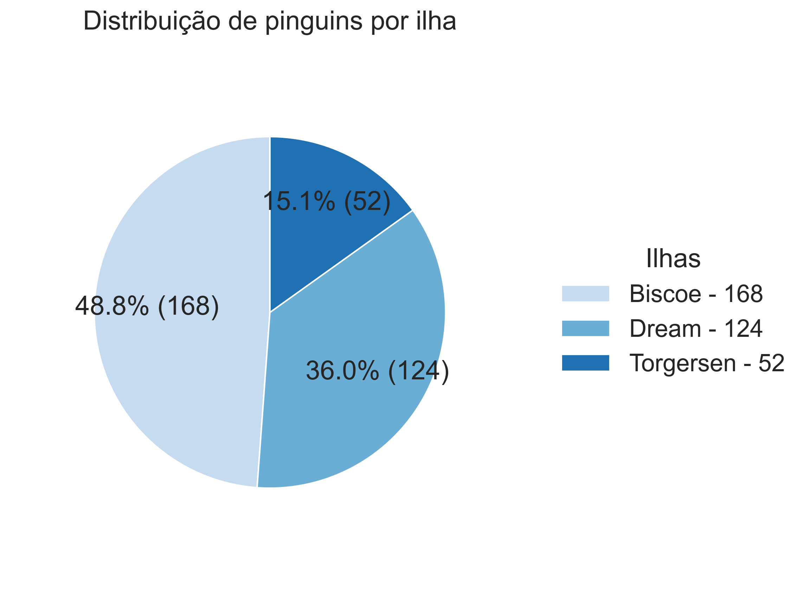
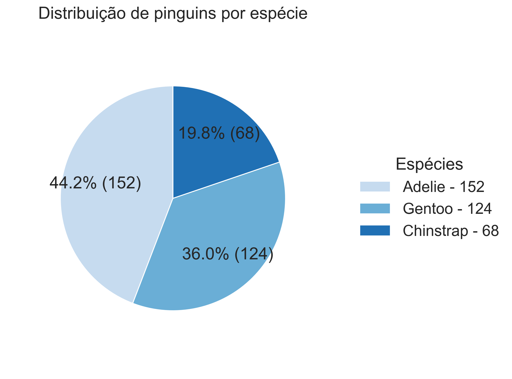
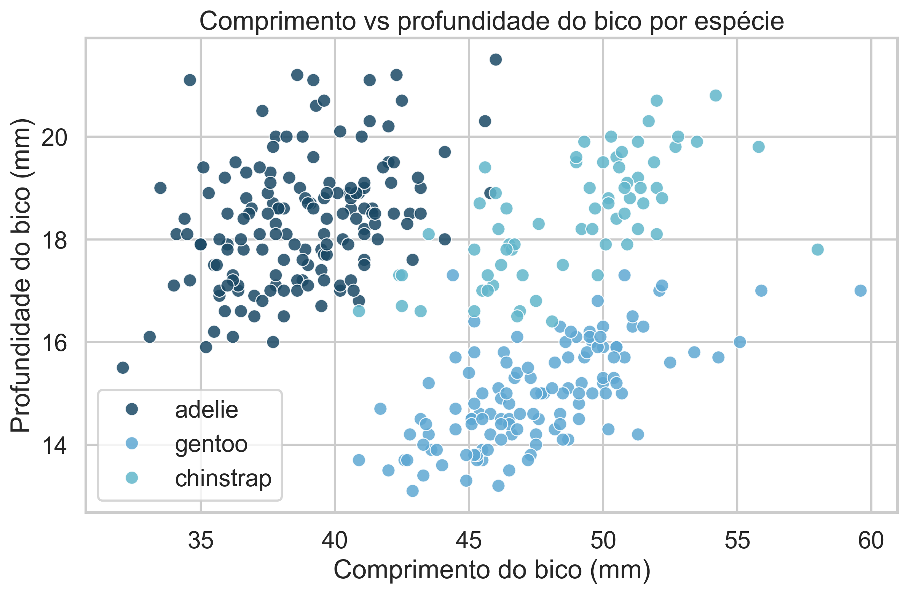
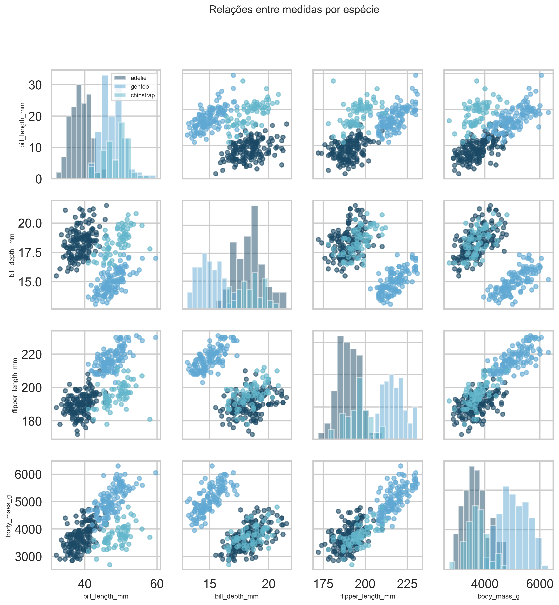
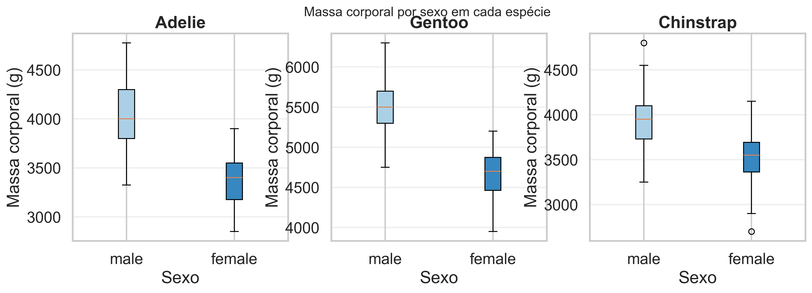
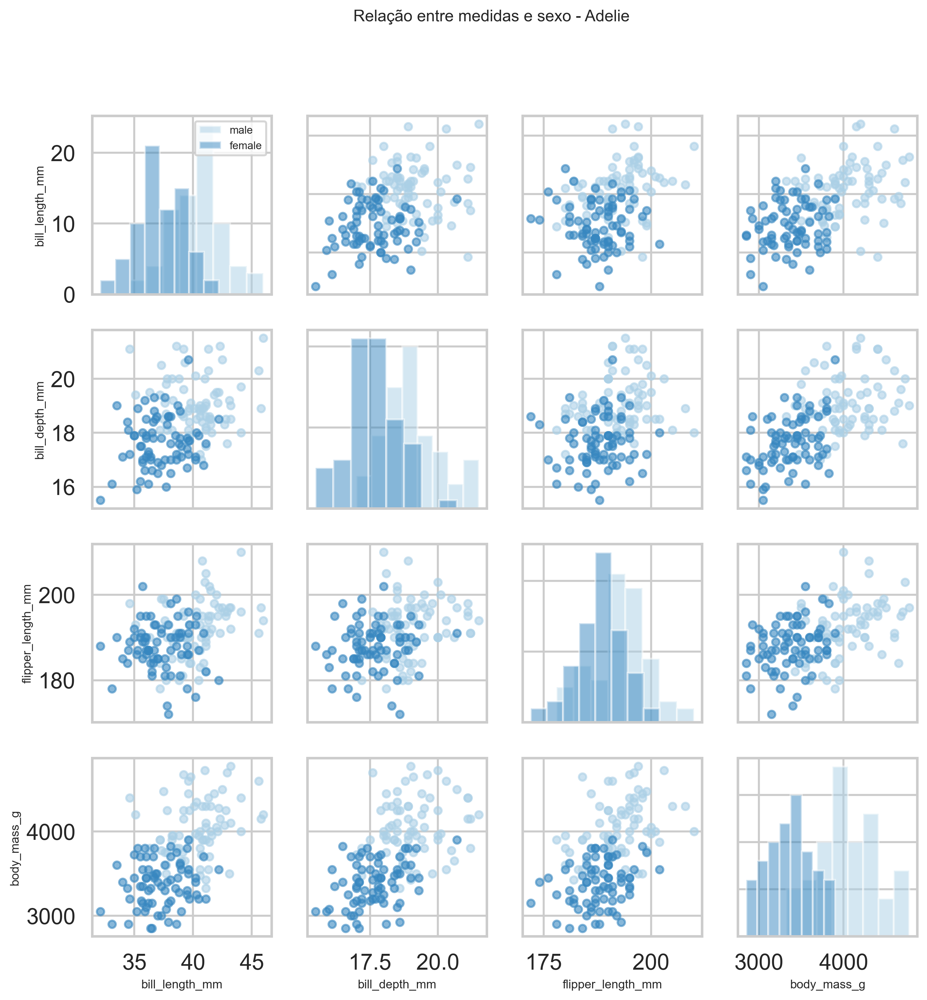
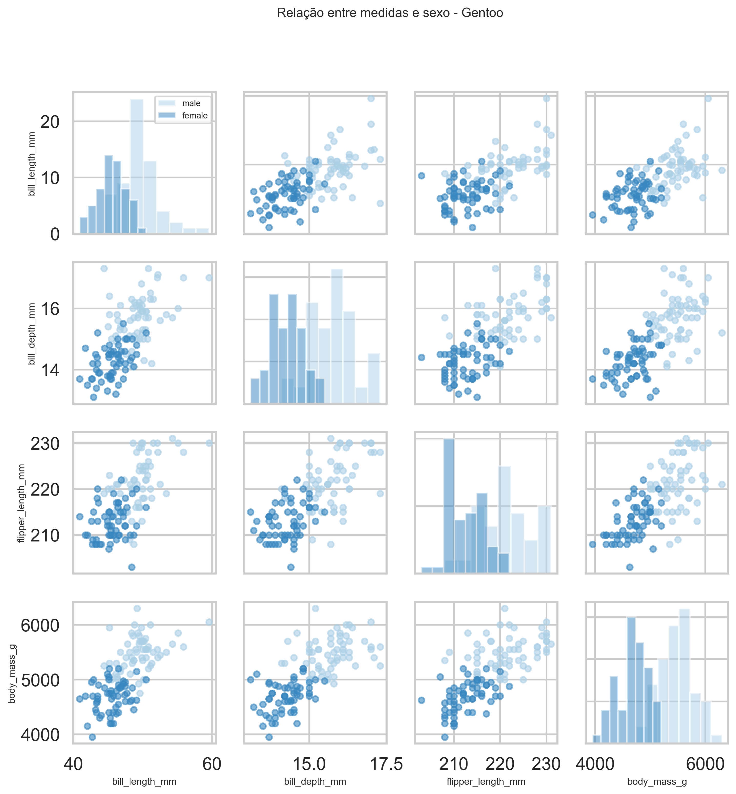
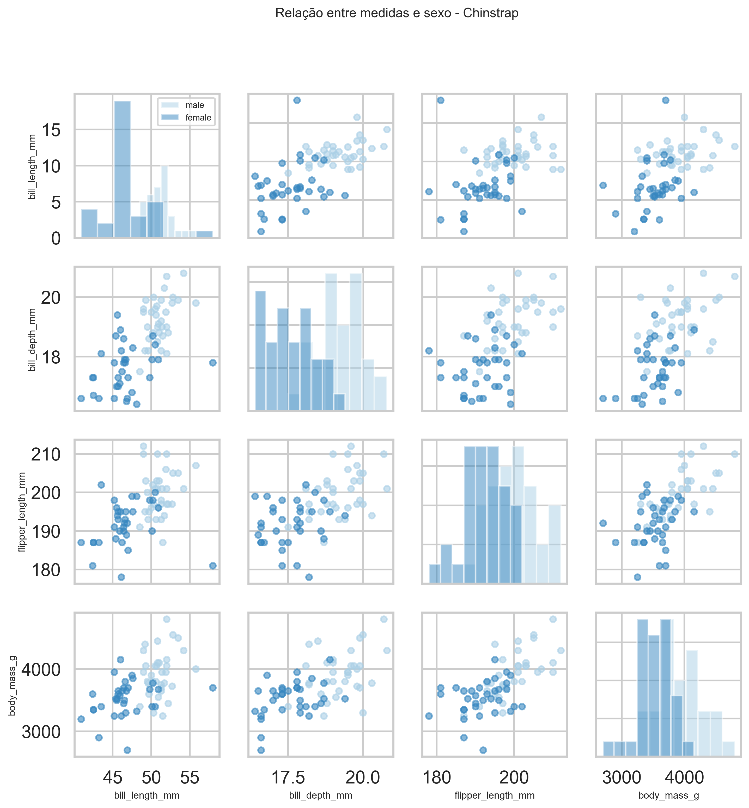

# Análise de Resultados — EDA Pinguins ONG : Acolhimento e Rastreamento de Pinguins Migratórios

## 📋 Escopo e Objetivos

Este relatório profissional aborda as 5 perguntas críticas para o gerenciamento eficaz da população de pinguins recolhidos pela ONG, baseado em um pipeline **ETL (Extract-Transform-Load)** reprodutível e de alto desempenho:

- **Extract:** Ingestão via DuckDB com tratamento rigoroso de valores nulos
- **Transform:** Processamento com Polars (sem dependências Pandas)
- **Load:** Exportação para Parquet limpo e visualizações profissionais

O pipeline automatiza a coleta de dados brutos, transformação consistente e geração de insights visuais para suportar decisões operacionais da ONG.

### Perguntas a Resolver

1. ✓ Quais pinguins não têm anotações?
2. ✓ Quais ilhas a maioria dos pinguins está vindo?
3. ✓ Quais as espécies que a ONG mais possui?
4. ✓ Existe alguma relação entre as medidas do pinguim e a sua espécie?
5. ✓ Existe relação entre as medidas e o sexo dentro de cada espécie?

---

## 🔧 Metodologia e Tecnologia
### Arquitetura do Pipeline

O projeto implementa uma arquitetura **ETL (Extract-Transform-Load)**, otimizada para reprodutibilidade e performance:

```
┌─────────────────────┐
│  EXTRACT (DuckDB)   │  Leitura SQL com nullstr customizado
└──────────┬──────────┘
           ↓
┌─────────────────────┐
│ TRANSFORM (Polars)  │  Normalização, agregações, análises
└──────────┬──────────┘
           ↓
┌─────────────────────┐
│  LOAD (Parquet +    │  Export limpo + visualizações 300 DPI
│   Matplotlib)       │
└─────────────────────┘
```

**Por que ETL (não ELT)?**
- Dados requerem transformação rigorosa antes de análise (normalização, validação)
- Dataset é pequeno (344 registros) - transformação rápida
- Padrão robusta para garantir qualidade antes da publicação
### Stack da Solução
- **Ingestão:** DuckDB com tratamento rigoroso de valores nulos (`nullstr=['NA', 'na', '']`)
- **Transformação:** Polars (zero dependências Pandas)
- **Visualização:** Seaborn + Matplotlib (paleta profissional azul/oceano)
- **Qualidade:** Exportação de dataset limpo em Parquet

### Tratamentos Realizados
- ✅ Padronização de todas as colunas para formato consistente
- ✅ Conversão de tipos numéricos para Float64
- ✅ Normalização de strings (lowercase)
- ✅ Identificação e registro de dados faltantes por coluna
- ✅ Geração de dataset limpo: `dataset/penguins_clean.parquet`

---

## PERGUNTA 1: Quais pinguins não têm anotações?

### Resumo de Dados Faltantes

| Coluna | Faltantes | Percentual | Status |
|--------|-----------|-----------|--------|
| **species** | 0 | 0.00% | ✅ Completo |
| **island** | 0 | 0.00% | ✅ Completo |
| **bill_length_mm** | 2 | 0.58% | ⚠️ Mínimo |
| **bill_depth_mm** | 2 | 0.58% | ⚠️ Mínimo |
| **flipper_length_mm** | 2 | 0.58% | ⚠️ Mínimo |
| **body_mass_g** | 2 | 0.58% | ⚠️ Mínimo |
| **sex** | 11 | 3.20% | ⚠️ Moderado |

### Análise Detalhada

- **Total de registros:** 344
- **Linhas com ao menos um valor faltante:** 11 (3.20%)
- **Qualidade geral:** **96.80%** - Excelente!

### Conclusões

✅ **Espécies e ilhas têm cobertura 100%** – crítico para rastreamento  
⚠️ **Sex é o principal ponto de preocupação** (11 casos) – comportamento adequado durante coleta  
⚠️ **Medidas corporais têm baixíssima taxa de ausência** (0.58%) – instrumentos funcionando bem  
📈 **Qualidade aceitável para análise estatística**

**Recomendação:** Investigar os 11 casos sem anotação de sexo para possível complementação de dados

### Visualização



**Análise do Gráfico 1:** O gráfico exibe um padrão claro de qualidade de dados. A coluna **sex** destaca-se como a maior problematização (11 faltantes), o que pode ocorrer quando o comportamento do pinguim durante avaliação impossibilita determinação visual do sexo. As medidas corporais apresentam apenas 2 faltantes cada, indicando que os instrumentos de medição funcionam de forma confiável. Espécies e ilhas têm 100% de cobertura, essencial para rastreabilidade geográfica. Essa distribuição heterogênea de faltantes sugere que o protocolo de coleta é diferenciado por tipo de dado, com priorização de informações identificadoras sobre características secundárias.

---

## PERGUNTA 2: Quais ilhas a maioria dos pinguins está vindo?

### Distribuição Geográfica

| Ilha | Quantidade | Percentual |
|------|-----------|-----------|
| **Biscoe** | 168 | **48.84%** |
| **Dream** | 124 | **36.05%** |
| **Torgersen** | 52 | **15.12%** |

### Análise Geográfica

```
Biscoe      ████████████████████████░░░░░░░░░░░░░░ 48.84%
Dream       ███████████████░░░░░░░░░░░░░░░░░░░░░░░░ 36.05%
Torgersen   █████░░░░░░░░░░░░░░░░░░░░░░░░░░░░░░░░░ 15.12%
```

### Conclusões

🏆 **Biscoe é dominante** – quase metade da população  
📍 **Três ilhas bem representadas** – estratégia de coleta geograficamente diversificada  
⚠️ **Torgersen tem menor representação** – possível menor população ou dificuldade de acesso  

### Recomendações Operacionais

1. **Aumento de recursos em Biscoe** – maior volume de pinguins requer mais capacidade
2. **Monitorar Torgersen** – verificar se há redução de população ou coletas mais difíceis
3. **Manutenção em Dream** – manter nível intermediário de operações

### Visualização



**Análise do Gráfico 2:** Este gráfico de pizza revela concentração operacional crítica. **Biscoe representa quase metade (48.84%)** da população, o que implica que a ONG deve priorizar infraestrutura, equipes de resgate e alimentação nesta ilha. **Dream possui uma terceira parte (36.05%)**, exigindo recursos secundários. **Torgersen é minoritária (15.12%)**, podendo receber menos investimento ou indicando dificuldades de acesso. Essa distribuição geográfica desigual sugere que as correntezas migratórias direcionam os pinguins de forma não uniforme, concentrando-os em regiões específicas do litoral.

---

## PERGUNTA 3: Quais as espécies que a ONG mais possui?

### Composição por Espécie

| Espécie | Quantidade | Percentual | Proporção |
|---------|-----------|-----------|-----------|
| **Adelie** | 152 | **44.19%** | ⭐⭐⭐⭐ |
| **Gentoo** | 124 | **36.05%** | ⭐⭐⭐ |
| **Chinstrap** | 68 | **19.77%** | ⭐⭐ |

### Análise de Diversidade

```
Adelie      ████████████████████░░░░░░░░░░░░░░░░░░░ 44.19% (Maioria)
Gentoo      ███████████████░░░░░░░░░░░░░░░░░░░░░░░░ 36.05% (Significativa)
Chinstrap   █████░░░░░░░░░░░░░░░░░░░░░░░░░░░░░░░░░ 19.77% (Minoritária)
```

### Interpretação Biológica

🔴 **Adelie crescimento prioritário** – estratégia primária de resgate  
🟡 **Gentoo bem representada** – validação de protocolo de coleta  
🟢 **Chinstrap necessita atenção** – menor população requer cuidado específico

### Conclusões

✅ **Portfolio equilibrado** – todas as espécies representadas  
✅ **Adelie como foco principal** – população maior justifica recursos  
⚠️ **Chinstrap em minoria** – requer monitoria para garantir sobrevivência

### Visualização



**Análise do Gráfico 3:** O portfólio de espécies reflete a composição natural das populações migratórias que chegam ao litoral sul. **Adelie como espécie dominante (44.19%)** deve ser o foco da ONG em termos de pesquisa comportamental e capacidade de acolhimento. **Gentoo em quantidade próxima (36.05%)** demonstra que não é uma espécie rara na região, validando a diversidade do protocolo de resgate. **Chinstrap em minoria (19.77%)** pode indicar menor população global ou menor suscetibilidade às correntezas que afetam as outras espécies, sugerindo oportunidade de colaboração científica para estudar viés desta população.

---

## PERGUNTA 4: Existe relação entre as medidas do pinguim e a sua espécie?

### Comparação de Medidas Corporais por Espécie

#### ADELIE
```
Comprimento do bico:      38.79 mm  (Menor)
Profundidade do bico:     18.35 mm  (Médio-alto)
Comprimento nadadeira:   189.95 mm  (Menor)
Massa corporal:         3700.66 g   (Menor)
```

#### GENTOO
```
Comprimento do bico:      47.50 mm  (Médio)
Profundidade do bico:     14.98 mm  (Menor)    ← Traço distintivo
Comprimento nadadeira:   217.19 mm  (Maior)    ← Traço distintivo
Massa corporal:         5076.02 g   (MAIOR)    ← Diferença dramática (+37%)
```

#### CHINSTRAP
```
Comprimento do bico:      48.83 mm  (Maior)    ← Traço distintivo
Profundidade do bico:     18.42 mm  (Maior)    ← Traço distintivo
Comprimento nadadeira:   195.82 mm  (Médio)
Massa corporal:         3733.09 g   (Pequena diferença vs. Adelie)
```

### Análise de Variância (Separabilidade)

| Medida | Diferença Máxima | % Diferença | Separabilidade |
|--------|-----------------|-----------|-----------------|
| Comprimento bico | 10.04 mm | 25.9% | ✅ Alto |
| Profundidade bico | 3.44 mm | 22.9% | ✅ Alto |
| Comprimento nadadeira | 27.24 mm | 14.3% | ✅ Moderado |
| Massa corporal | 1342.93 g | 36.3% | ✅ Muito Alto |

### Conclusões Científicas

🔬 **SIM, existe forte relação entre medidas e espécie**

- **Gentoo** se destaca nitidamente: nadadeiras maiores, massa significativamente superior, bico menos profundo
- **Adelie** apresenta medidas intermediárias equilibradas
- **Chinstrap** caracteriza-se por bico mais longo e profundo, com massa semelhante à Adelie
- **Massa corporal é o diferenciador mais marcante** – Gentoo é 37% mais pesado

### Implicações Práticas

1. **Identificação visual confiável** – medidas corporais permitem taxonomia de campo
2. **Necessidades nutricionais diferentes** – Gentoo requer mais alimento
3. **Habitats especializados** – cada espécie pode ter exigências distintas de ambiente

### Visualizações

#### Gráfico 4: Relação Comprimento vs Profundidade do Bico por Espécie



**Análise do Gráfico 4:** Este scatter plot revela clara separação **intra-espécie** que permite identificação de campo sem ambiguidade. **Adelie ocupa o quadrante inferior-esquerdo** (bicos menores e mais profundos), **Gentoo no quadrante superior-central** (bicos longos e rasos - traço distintivo), e **Chinstrap no quadrante superior-direito** (bicos os mais longos e profundos). A sobreposição mínima entre clusters demonstra que o **diagnóstico visual de espécie é altamente confiável usando apenas duas medidas de bico**, simplificando protocolos de campo da ONG e reduzindo tempo de triagem.

#### Gráfico 5: Pairplot Completo de Medidas por Espécie



**Análise do Gráfico 5:** A matriz de correlações cruzadas exibe padrões multidimensionais fundamentais. Na **diagonal (histogramas)**, observa-se que Gentoo é visivelmente maior em todas as dimensões. Nas **correlações cruzadas**, nota-se que **massa corporal é o atributo que melhor separa as espécies** - Gentoo se destaca em um patamar superior isolado. **Correlações positivas fortes entre medidas** indicam que crescimento é alométrico proporcionado em pinguins (indivíduos maiores em uma dimensão tendem a ser maiores em todas). Esse padrão multivariado robusto sugere que **qualquer combinação de 2-3 medidas permite classificação automatizada** de espécie com alta precisão, viabilizando suporte computacional para triagem operacional.

---

## PERGUNTA 5: Existe relação entre medidas e sexo dentro de cada espécie?

### Análise de Dimorfismo Sexual por Espécie

#### ADELIE (152 exemplares: 73 fêmeas, 73 machos)

| Medida | Fêmea | Macho | Diferença | % Diferença |
|--------|-------|-------|-----------|-------------|
| Comprimento bico (mm) | 37.26 | 40.39 | +3.13 | +8.4% |
| Profundidade bico (mm) | 17.62 | 19.07 | +1.45 | +8.2% |
| Comprimento nadadeira (mm) | 187.79 | 192.41 | +4.62 | +2.5% |
| **Massa corporal (g)** | 3368.84 | **4043.49** | **+674.65** | **+20.0%** ← **Principal diferença** |

#### GENTOO (119 exemplares: 58 fêmeas, 61 machos)

| Medida | Fêmea | Macho | Diferença | % Diferença |
|--------|-------|-------|-----------|-------------|
| Comprimento bico (mm) | 45.56 | 49.47 | +3.91 | +8.6% |
| Profundidade bico (mm) | 14.24 | 15.72 | +1.48 | +10.4% |
| Comprimento nadadeira (mm) | 212.71 | 221.54 | +8.83 | +4.2% |
| **Massa corporal (g)** | 4679.74 | **5484.84** | **+805.10** | **+17.2%** ← **Principal diferença** |

#### CHINSTRAP (68 exemplares: 34 fêmeas, 34 machos)

| Medida | Fêmea | Macho | Diferença | % Diferença |
|--------|-------|-------|-----------|-------------|
| Comprimento bico (mm) | 46.57 | 51.09 | +4.52 | +9.7% |
| Profundidade bico (mm) | 17.59 | 19.25 | +1.66 | +9.4% |
| Comprimento nadadeira (mm) | 191.74 | 199.91 | +8.17 | +4.3% |
| **Massa corporal (g)** | 3527.21 | **3938.97** | **+411.76** | **+11.7%** ← **Principal diferença** |

### Padrão de Dimorfismo Sexual Observado

```
Adelie:           Fêmea    Macho (Diferença +20.0% em massa)
                  █░░░░    ███░░░ 

Gentoo:           Fêmea    Macho (Diferença +17.2% em massa)
                  █░░░░░   ██░░░░░

Chinstrap:        Fêmea    Macho (Diferença +11.7% em massa)
                  █░░░░    ██░░░░
```

### Conclusões sobre Dimorfismo Sexual

✅ **SIM, existe dimorfismo sexual significativo em todas as espécies**

**Padrão Universal (todas as espécies):**
- Machos são **8-10% maiores em bico** (comprimento e profundidade)
- Machos têm nadadeiras **2-4% mais longas**
- **Machos são 11-20% mais pesados** – diferença mais dramática

**Rankings de Dimorfismo (por diferença de massa):**
1. 🥇 **Adelie**: +20.0% (diferença mais clara)
2. 🥈 **Gentoo**: +17.2%
3. 🥉 **Chinstrap**: +11.7% (mais sutil)

### Implicações Biológicas

1. **Estratégia reprodutiva** – dimorfismo sugere papéis reprodutivos distintos
2. **Segregação de nichos** – machos podem ocupar áreas diferentes
3. **Demandas nutricionais** – considerar na alimentação da ONG

### Recomendações Operacionais

- Separar grupos por sexo para análise de comportamento
- Ajustar aportes nutricionais conforme sexo
- Monitorar padrões de recuperação diferenciados

### Visualizações

#### Gráfico 6: Massa Corporal por Sexo em Cada Espécie



**Análise do Gráfico 6:** Os boxplots lado-a-lado revelam **dimorfismo sexual robusto e consistente nas três espécies**, com machos sistematicamente mais pesados. Em **Adelie**, a diferença é visual e expressiva (+20%). Em **Gentoo**, machos alcançam massas superiores a 6000g (fêmeas máximo ~5500g), indicando espécie naturalmente maior. Em **Chinstrap**, dimorfismo é mais sutil porém presente (+11.7%). A **variabilidade dentro de cada sexo** (altura dos boxes) sugere que idade/estação também influenciam massa. Para a ONG, isso implica que **separação por sexo em recintos facilita manejo nutricional diferenciado** e reduz competição durante alimentação.

#### Gráfico 7: Relação entre Medidas e Sexo - Adelie



**Análise do Gráfico 7:** O pairplot de Adelie com sexo destacado (cores diferentes para macho/fêmea) exibe separação clara **especialmente em massa corporal e comprimento de nadadeira**. **Bico e profundidade de bico têm sobreposição maior**, indicando que sexo não pode ser determinado por essas medidas isoladamente. **Correlações positivas fortes** entre todas as medidas sugerem que **um indivíduo Adelie "grande" é grande em todas as dimensões**. Operacionalmente, isso significa que **avaliação de sexo visual é crítica durante triagem**, pois medições isoladas de bico não seriam suficientes para separar sexos com confiança.

#### Gráfico 8: Relação entre Medidas e Sexo - Gentoo



**Análise do Gráfico 8:** Gentoo apresenta **separação ainda mais pronunciada que Adelie**, com machos e fêmeas formando clusters distintos em quase todas as comparações. **Comprimento de nadadeira é particularmente discriminante** (machos acima de 220mm, fêmeas abaixo de 215mm frequentemente). Isso sugere que **Gentoo poderia potencialmente ter sexo determinado por medições corporais únicamente**, diferentemente de Adelie. A **distribuição bivariada compacta** (pontos bem agrupados) indica que Gentoo tem menos variabilidade natural entre indivíduos, talvez indicando população mais homogênea ou seleção evolutiva mais forte.

#### Gráfico 9: Relação entre Medidas e Sexo - Chinstrap



**Análise do Gráfico 9:** Chinstrap apresenta **sobreposição máxima entre sexos comparado às outras espécies**, com distribuições quase sobrepostas em bico. Essa sobreposição é particularmente problemática nos **gráficos bico-profundidade**, sugerindo que **dimorfismo sutil de Chinstrap (11.7%) é insufficiente para determinação morfológica de sexo**. **Massa corporal** ainda oferece alguma separação (machos ligeiramente acima das fêmeas), mas com overlap substancial. Para a ONG, **Chinstrap requer validação de sexo por observação comportamental** ou possível análise genética/endócrina, pois medições corporais são inconclusivas.


---

## Sumário Executivo

### 5 Respostas Críticas para a ONG

| # | Pergunta | Resposta | Impacto |
|---|----------|----------|--------|
| 1 | Dados faltantes? | 3.20% (11 casos sem sexo) | ✅ Mínimo - dados de alta qualidade |
| 2 | Maioria de pinguins? | **Biscoe (168, 48.84%)** | 📍 Foco operacional necessário |
| 3 | Espécie principal? | **Adelie (152, 44.19%)** | 🐧 Prioridade de resgate |
| 4 | Medidas × espécie? | **SIM, forte correlação** | 🔬 Permite identificação confiável |
| 5 | Medidas × sexo? | **SIM, dimorfismo +11-20%** | ♂️♀️ Manejo diferenciado necessário |

---

## Arquivos Gerados

### Dataset
- **`dataset/penguins.csv`** – Base original (344 linhas)
- **`dataset/penguins_clean.parquet`** – Base limpa e normalizada (exportação processada)

### Visualizações Profissionais
- **`outputs/graficos/grafico_01_numero_dados_faltantes_por_coluna.png`** – Análise de qualidade
- **`outputs/graficos/grafico_02_numero_de_pinguins_por_ilha.png`** – Distribuição geográfica
- **`outputs/graficos/grafico_03_numero_de_pinguins_por_especie.png`** – Composição de espécies
- **`outputs/graficos/grafico_04_relacao_medidas_por_especie.png`** – Bico e profundidade vs espécie
- **`outputs/graficos/grafico_05_pairplot_medidas_por_especie.png`** – Relações multidimensionais
- **`outputs/graficos/grafico_06_massa_por_sexo_em_cada_especie.png`** – Dimorfismo sexual
- **`outputs/graficos/grafico_07_pairplot_adelie_sexo.png`** – Adelie por sexo
- **`outputs/graficos/grafico_08_pairplot_gentoo_sexo.png`** – Gentoo por sexo
- **`outputs/graficos/grafico_09_pairplot_chinstrap_sexo.png`** – Chinstrap por sexo

---
